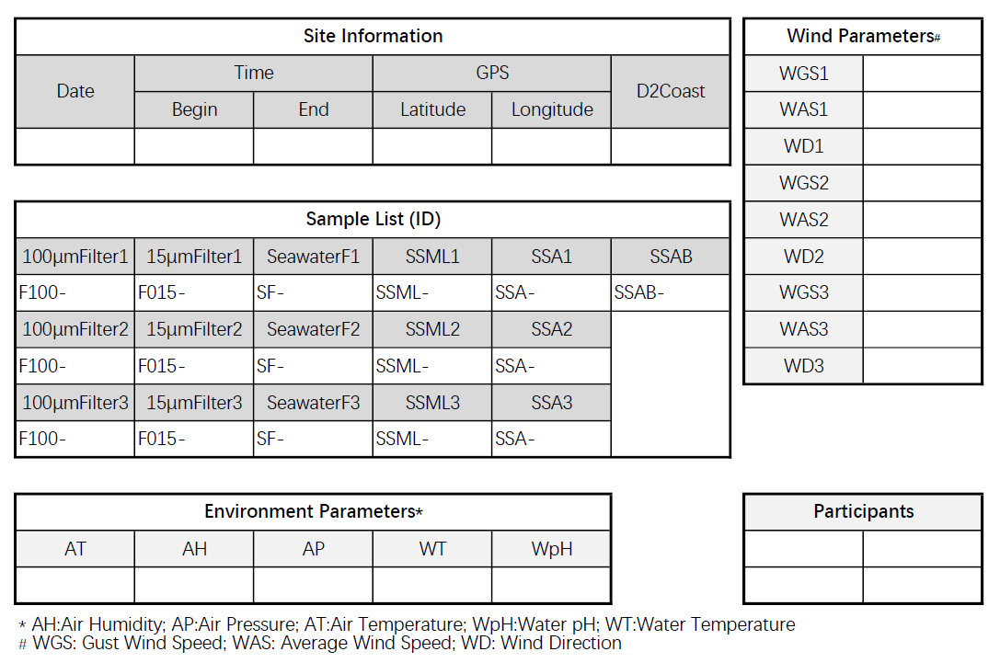

# 1.1.Site Information

Site information listed below should be recorded each time before sampling processes. Table 1.1 gives an example of site information parameters that should be filled in and measured on-site.



