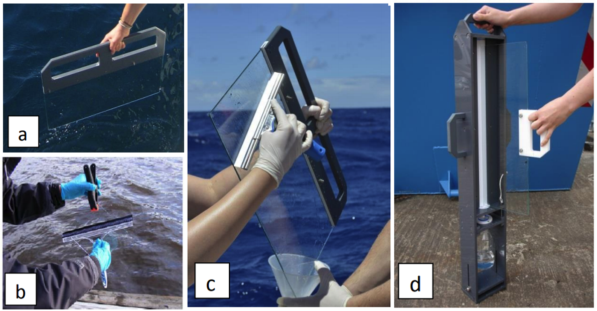

# 1.2.1.2.Glass Panel Sampling Method

**Equipment**

* Glass panel sampler
* Polyethylene vessels
* Funnel
* Silicone wiper

**Sampling procedures**

* Rinse the glass plate, vessels and funnels with acetone and air-dried.
* Insert the glass plate vertically into the seawater with the handle and slowly lift it out, keep it vertical during the procedure.
* Use the wiper to scrape off the liquid adhered to the glass plate, collect it in the vessel via funnel.
* Mark the vessels

a\)glass plate sampler with integral PVC handle showing sample collection \(courtesy of Manuela van Pinxteren, TROPOS, Germany\).  
b\) squeegeeing a simple plate sampler held with a clean plastic clamp.  
c\) squeegeeing a glass plate sampler using “clean hands/dirty hands” technique \(courtesy of Manuela van Pinxteren, TROPOS, Germany\).  
d\) a glass plate and sample recovery device containing integral Teflon wiper and funnel, based on the design of Hardy et al. \(1985\).

