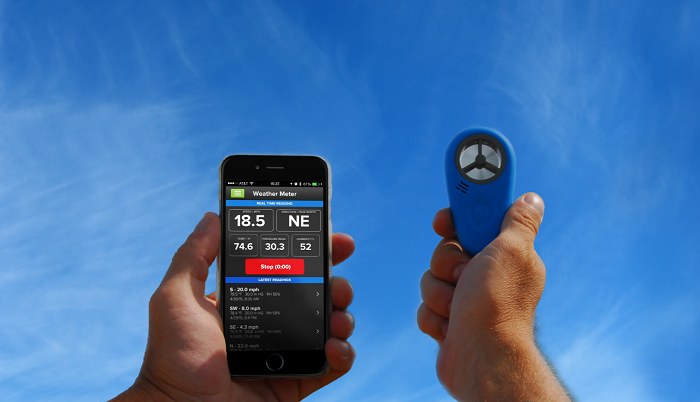

# 1.1.3.Wind Speed and Direction

Wind speed and direction should be measured with [WeatherFlow WINDmeter](https://weatherflow.com/weather-meter/). Measurement should be performed three times: before, during, and after the sampling process. Both average speed and gust speed should be recorded. See [HERE](https://help.weatherflow.com/hc/en-us/articles/207905908-WEATHERmeter-User-Guide) for the device user guide

| Parameter | Unit | Accuracy | Description |
| :--- | :--- | :--- | :--- |
| WGSpeed1 | km per hour | 1 decimal place | Gust wind speed before sampling |
| WASpeed1 | km per hour | 1 decimal place | Average wind speed before sampling |
| WDirection1 | ° | 1 decimal place | Wind direction before sampling |
| WGSpeed2 | km per hour | 1 decimal place | Gust wind speed during sampling |
| WASpeed2 | km per hour | 1 decimal place | Average wind speed during sampling |
| WDirection2 | ° | 1 decimal place | Wind direction during sampling |
| WGSpeed3 | km per hour | 1 decimal place | Gust wind speed after sampling |
| WASpeed3 | km per hour | 1 decimal place | Average wind speed after sampling |
| WDirection3 | ° | 1 decimal place | Wind direction after sampling |

