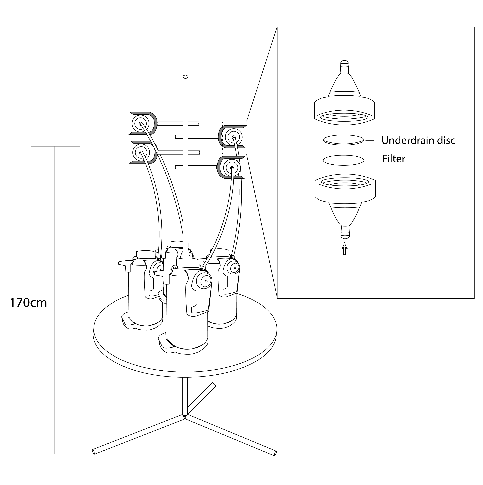

# 1.3.Aerosol Sampling

**Equipment**

* Constant flow vacuum pumps
* Filters \(type to be discussed\)
* Filter holders
* PVC tubes
* Ziplock bags
* Anti-oxidation bags

**Filter holder preparation**

* Each time 5 filter holders will be prepared, 4 for actural sampling and 1 for blank \(carried with other three and\).
* Wash the filter holders and underdrain discs \(Figure\) with deionized water and then rinse with acetone. Remove residual acetone using purified high-pressure air.
* Use clean tweezer to place a filter on the underdrain discs fitted in the filter holder, note that the front of the filter is facing outward \(to the air inlet\).
* Make a small mark on the filter edge, align the mark on the filter with the valve on the outside of the filter holder, and close the filter firmly.
* Put the prepated filter holder into ziplock bag for latter usage.

**Sampling procedures**

_Field Setups:_

* Setting up the stand on a solid foundation, no block in the upwind direction.
* Mark the filter holders as either sample or blank.
* Clip the prepared filter holders on the stand, at a hight around 170 cm. Make sure the air inlet facing the upwind direction, and the valve on the outside of the filter holder is up right.
* Connect each filter holder to a vacuum pump with PVC tubes.
* If a diesel generator is used, it needs to be placed in the downwind and as far away from the sampling area as possible

_SSA sample collection:_

* Open the air sampling pump with a flow rate of 10 L·min-1 for about 200 minutes, till 2000 L air flow collected \(calculated by pump build-in counter\).
* Keep the upwind clear without people and make notes if there is anyting wrong.
* After stoping the pump, remove the tubes on the filter holds and put it into ziplock bag with anti-oxidation bags.

