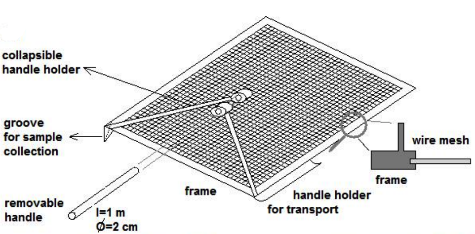
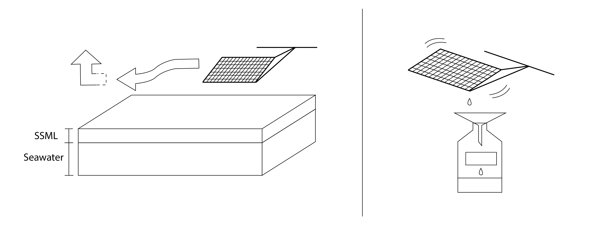

# 1.2.1.1.Mesh Screen Sampling Method

This sampling method is preferred when the wind and waves are not strong. Otherwise, please use the glass plate sampling method.

**Equipment**

* Screen sampling device \(mesh size 1 mm2, Lechtenfeld et al., 2013\)
* Polyethylene vessels
* Funnel

**Sampling procedures**

* Rinse the mesh screen, vessels and funnels with acetone and air-dried.
* Put the rinsed screen into the seawater at an angle, once it is submerged completely in the water, it should be kept horizontal and wait for 30 seconds.
* Slowly lift the screen vertically out of the seawater.
* Tilt the screen at an angle, so that the SSML sample can drop into the funnel and finally collected in the vessels.
* Mark the vessels

